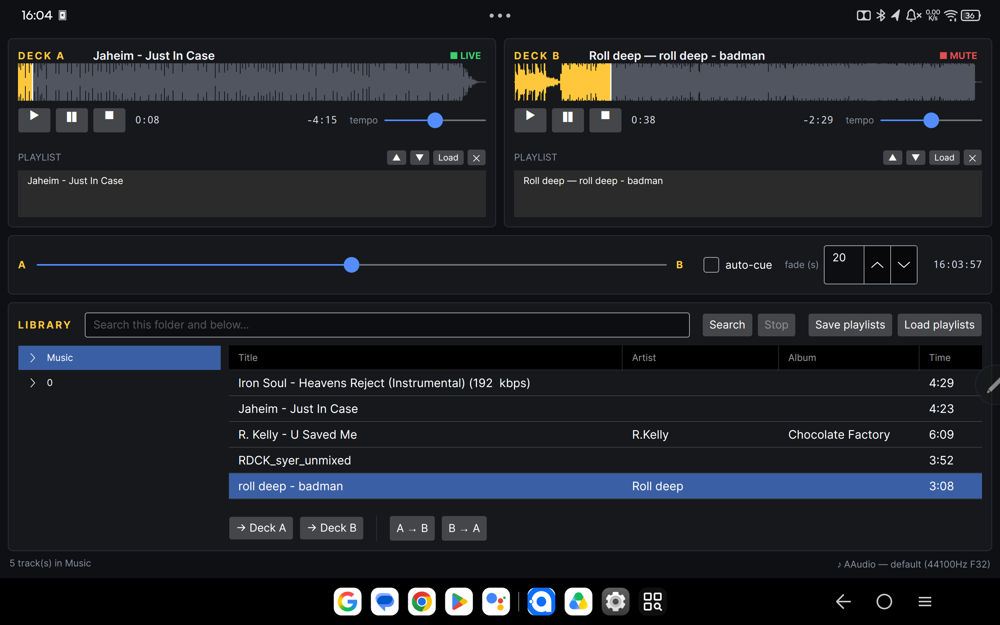
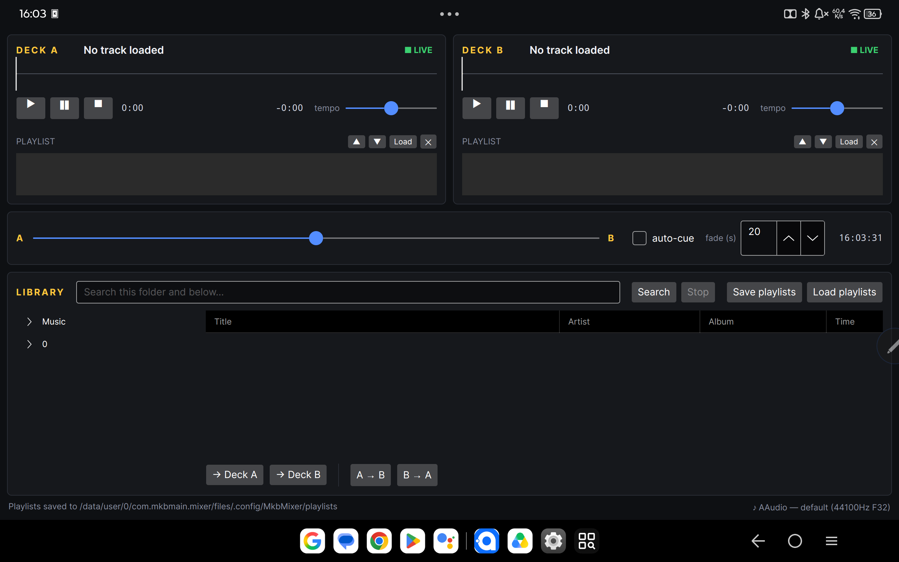

# MKB Music Mixer

A cross-platform dual-deck DJ mixer for Linux, macOS, Windows and Android (tablets and phones).



This is a rewrite of a .NET 2.0 WinForms application from roughly 2005. The original
was Windows-only by construction: it drove two `WMPLib.WindowsMediaPlayer` COM
objects, enumerated drive letters, and assumed `\` path separators throughout.
The core idea — two decks, a crossfader between them, and an auto-cue that mixes
the next track in as the current one runs out — is unchanged.

## Requirements

- .NET 10 SDK
- A working audio output device (PulseAudio, PipeWire, ALSA or JACK on Linux;
  CoreAudio on macOS; WASAPI on Windows)

## Running

```bash
dotnet run --project src/Mkb.Mixer.App.Desktop
```

Works on Linux: it is developed and tested there, with audio through
PulseAudio or PipeWire (JACK and ALSA as fallbacks). If you get no sound, see
[If playback is silent](#if-playback-is-silent).

## Android

Needs the .NET Android workload (`dotnet workload install android`) and an
Android SDK. To build an APK into `dist/`:

```bash
./build-apk.sh            # Release
./build-apk.sh Debug
adb install -r dist/mkb-mixer-1.0-release.apk
```

It is signed with your local debug key unless `ANDROID_KEYSTORE`,
`ANDROID_KEY_ALIAS` and `ANDROID_KEYSTORE_PASSWORD` are set; see the top of the
script.

CI builds a Release APK on every push and PR (the `mkb-mixer-apk` artifact on the
run), and pushing a `v*` tag attaches it to a GitHub release. To sign those with
your release key, add the repository secrets `ANDROID_KEYSTORE_BASE64`
(`base64 -w0 release.keystore`), `ANDROID_KEY_ALIAS`, `ANDROID_KEYSTORE_PASSWORD`
and optionally `ANDROID_KEY_PASSWORD`; without them CI signs with a throwaway
debug key.

For a quick edit-and-run loop with a tablet connected over USB:

```bash
dotnet build src/Mkb.Mixer.App.Android -t:Run
```

The app asks for access to audio files on first launch; without it the library
browser shows folders but no tracks. On Android 13 and later it also asks to post
notifications. The library lists every mounted volume by path: `Music`, internal
shared storage, and any SD card or USB drive. Roots refresh when a card or drive
is inserted or removed.



On a tablet the app is locked to landscape and shows the desktop layout. On a
phone (shortest side under 600dp) it is locked upright and splits into three
tabs: **Mix** (both decks and the crossfader), **Playlists** and **Library**.

While either deck is playing, a foreground service keeps the app alive with the
screen off and shows a notification naming what is playing; tapping it returns to
the app. The service stops after 10 seconds of silence.

The notification, the lock screen and headset or Bluetooth buttons pause and
resume the whole mix. The mix also pauses when another app starts playing music,
during a phone call (resuming afterwards if the call is under 10 minutes), and
when the output it is playing through disconnects — wired headphones unplugged,
or a Bluetooth speaker going out of range. A text arriving, a voice note, or a
Bluetooth device that is not the audio output (a watch, say) disconnecting does
not interrupt it. After one of those pauses the play button keeps working for 10
minutes.

## Headphone cue

Each deck has a **CUE** button that sends it to the headphones before the
crossfader, so the next track can be lined up without the room hearing it. Pick a
mode in the *headphones* row under the crossfader:

| Mode | Use it when |
|---|---|
| **Off** | No headphones. Normal stereo output. |
| **Split** | One output and a splitter cable — the usual phone setup. The room mix plays in mono on the left channel and the headphones in mono on the right. |
| **Device** | A second output, such as USB headphones or a second sound card. The room mix stays stereo on the main output. |

In Device mode, pick the output your headphones are on from the list. The output
the room mix is playing on is not offered, and if the headphone output disappears
mid-set the cue switches itself off.

The *cue — master* slider sets what the headphones hear, from the cued decks alone
to the room mix alone. Most phones can only play through one output at a time, so
Device mode there is best-effort; use Split.

## Shuffle and repeat

**⇄** makes a deck take a random track from its queue, and **↻** puts each played
track back on the end of the queue so it never runs dry. Both are per deck and
apply to the auto-cue as well as to a track simply ending. With both on, the same
song is never picked twice in a row.

## Library

Tap a column header to sort; Time and BPM sort by value. A ✓ marks tracks already
played this session, and **★ Recently played** at the top of the folder tree lists
the last 100 tracks played, newest first. A track counts as played after 30
seconds, or when it ends.

With **analyse BPM** on, opening a folder works out each track's BPM in the
background, one track at a time, and the column fills in as it goes. Results are
kept, so each file is only analysed once unless it changes. It is on by default on
desktops and tablets and off on phones, where it costs battery the first time a big
folder is opened.

**BPM [ ]–[ ]** lists only tracks in that range; **≈** fills it with the playing
deck's BPM ±6%, which is roughly what will mix with it.

## BPM and sync

Each deck shows its track's BPM at the current tempo. BPM detection folds results
into 87.5–175, so a 75 BPM track reads as 150: tap the BPM to correct it with ×½ or
×2, and the correction is kept for that track.

**SYNC** sets this deck's tempo so it plays at the other deck's BPM. It matches
speed, not beat position: hold **‹** or **›** to slow down or speed up by 4% while
lining the beats up by ear.

## Hot cues

**1–4** on each deck: tap an empty one to mark the playhead, tap a set one to jump
there (playing stays playing; stopped stays stopped at the cue). Long-press, or
right-click with a mouse, to clear one. Cues show on the waveform and are kept per
track.

## Smart auto-cue

The fade is timed to finish at the outgoing track's last real sound rather than the
end of the file, so trailing silence and long near-silent fade-outs are skipped.
The incoming track starts at hot cue 1 if it has one, otherwise at its first sound.
Each deck's next track is picked and analysed ahead of time so this information is
ready when the fade begins.

**match tempo** under the crossfader decides what happens to speed:

| Mode | What it does |
|---|---|
| **off** | Each track plays at its own speed. |
| **match** | The incoming track is sped up or slowed to the outgoing track's BPM, and stays there. |
| **match + glide** | As match, then eases back to normal speed over 8 seconds once the fade is done. |

Matching only happens when both BPMs are known and within 8% of each other;
otherwise that transition plays both at their own speed.

## If playback is silent

The status bar's bottom-right corner always shows the audio route in use, for
example `♪ PulseAudio — Built-in Audio`, or `♪ no audio output` if no device could
be opened.

To see what your machine offers:

```bash
dotnet run --project src/Mkb.Mixer.App.Desktop -- --audio-info
```

That reports every backend miniaudio was compiled with, whether its context
initialises, how many playback devices it sees, and whether a device actually
opens. To force one:

```bash
dotnet run --project src/Mkb.Mixer.App.Desktop -- --backend=PulseAudio
```

Valid values on Linux are `PulseAudio`, `Jack`, `Alsa` and `Oss`. A specific sink
can be forced by name substring:

```bash
dotnet run --project src/Mkb.Mixer.App.Desktop -- --device="Built-in Audio"
```

### "only a dummy/null sink is available"

The backend connected but offered nothing except a null device, which discards
everything. The app refuses to use one, because playing into a null sink is silent
and races the playhead to the end of the track. Check that a sound server is
actually running and exposing a sink:

```bash
pactl info                 # PulseAudio / pipewire-pulse server
pactl list short sinks     # should list at least one real sink
wpctl status               # if you are on PipeWire
aplay -l                   # ALSA hardware the kernel can see
```

The app probes each backend, then the default device followed by each named
device, against several formats, and uses the first combination that opens.
`Default Device` failing while a named device works is common and handled
automatically.

ALSA errors such as `unable to open slave` or `Unknown PCM dmix` usually mean
PulseAudio or PipeWire already holds the sound card, so the raw ALSA device cannot
be opened. The app tries PulseAudio first and falls back to JACK then ALSA, each
backend probed independently, because a backend whose *context* initialises can
still fail to open a *device*.

## Tests

```bash
dotnet test
```

The suite covers the crossfade curve, the auto-cue state machine, playlist and
settings persistence, waveform reduction, and a headless render of the real window.
None of it needs a sound card.

## Layout

| Project | Contains |
|---|---|
| `src/Mkb.Mixer.Audio` | `IDeck`/`IAudioEngine`, the crossfade curve, the auto-cue state machine, waveform reduction, and the SoundFlow implementation |
| `src/Mkb.Mixer.Library` | Folder scanning, ID3 tag reading, M3U playlists, settings |
| `src/Mkb.Mixer.App` | Avalonia UI (MVVM), shared by every platform |
| `src/Mkb.Mixer.App.Desktop` | Desktop entry point and the `--audio-info` diagnostic |
| `src/Mkb.Mixer.App.Android` | Android entry point, permissions and manifest |
| `tests/Mkb.Mixer.Tests` | xUnit |

Everything above `Mkb.Mixer.Audio` talks to `IDeck` and `IAudioEngine`, so the
audio library is swappable and the logic is testable without an audio device.

## What changed from the original

**Fixed bugs**

- *The crossfader was discontinuous.* Deck A sat at full gain across the whole
  left half of the fader, then jumped from 1.0 to 0.49 at the midpoint. The
  `(100 - v) * 2` term also overflowed to 200 and was silently clamped. It is now
  a constant-power curve, continuous and symmetric, verified by tests.
- *The auto-cue often never fired.* The trigger was `if (timeleft == 20)` — exact
  integer equality against a value sampled by a 1050 ms timer. A tick landing on
  21 then 19 skipped the window entirely. It is now a `>=` threshold guarded by an
  explicit state machine, with the fade interpolated on elapsed wall-clock time.
- *Scanning froze the UI.* The original recursed on the UI thread calling
  `Application.DoEvents()`. Scanning is now async and cancellable.
- *Closing the app called `Process.GetCurrentProcess().Kill()`.* The engine is
  disposed properly instead.
- Roughly thirty empty `catch {}` blocks are gone; failures that matter surface in
  the status bar.

**Added**

- Waveform display with click-and-drag seeking. The original had no seek at all.
- ID3/Vorbis/MP4 tags, so lists show `Artist — Title` rather than `C:\Music\x.mp3`.
- Playlists saved as M3U, and settings persisted between runs.
- Tempo control that preserves pitch (WSOLA) rather than resampling.
  Tap the tempo readout (or double-tap the slider) to snap back to 1.00×.
- FLAC, OGG, M4A, AAC and Opus support.
- Headphone cue, in Split (one output and a splitter) or second-device mode.
- Per-deck shuffle and repeat.
- Android media controls, and pausing for calls, other music apps and lost outputs.
- BPM detection, SYNC and nudge; hot cues; play history and a BPM filter in the library.
- An auto-cue that fades on real sound and can match tempo across the transition.

## Known limitations

- **SYNC matches tempo, not beat position.** Beat positions are detected and stored,
  ready for phase sync, but nothing uses them yet; line beats up with the nudge buttons.
- **BPM detection folds into 87.5–175.** Slower or faster tracks read at double or
  half; correct them once with ×½ or ×2.
- **WMA only decodes on Windows.** It is a Microsoft codec with no cross-platform
  decoder in this stack. The original supported `.mp3`, `.wma` and `.wav`.
- **Tempo always preserves pitch.** SoundFlow routes `PlaybackSpeed` through WSOLA
  unconditionally, so the original's pitch-shifting speed control cannot be
  reproduced without adding a resampling path.
